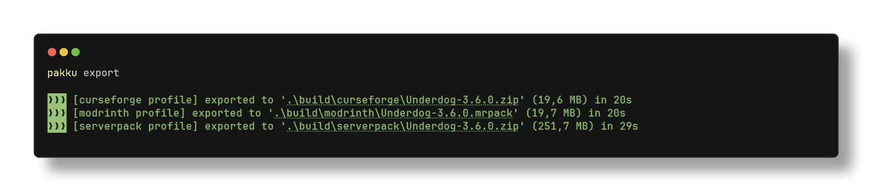
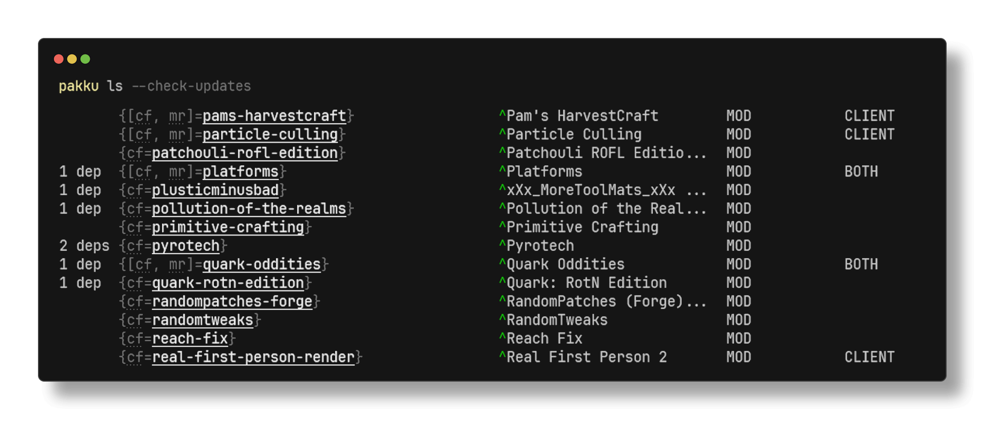

  
  <h1 align="center">Pakku</h1>

  A multiplatform modpack manager for Minecraft: Java Edition.

  
  
  
  

## About

With **Pakku**, you can create modpacks for **CurseForge**, **Modrinth** or **both simultaneously**.

It's a package manager that significantly simplifies Minecraft modpack development, inspired by package managers like npm and Cargo.
In addition to package management itself, it enables support for version control, simplifies collaboration options, and adds support for CI/CD.

## Features

**A comprehensive toolkit for modpack development:**

Project operations
<pre>
 <kbd>pakku add</kbd> &#9;» Add new projects with automatic dependency resolution
 <kbd>pakku rm</kbd> &#9;» Remove projects safely with dependency checking
 <kbd>pakku update</kbd> &#9;» Update projects individually or in bulk
 <kbd>pakku ls</kbd> &#9;» List and inspect project details
 <kbd>pakku diff</kbd> &#9;» Compare different versions of your modpack
</pre>

Development environment
<pre>
 <kbd>pakku init</kbd> &#9;» Create a new modpack
 <kbd>pakku import</kbd> &#9;» Import existing modpacks
 <kbd>pakku fetch</kbd> &#9;» Set up or update your development environment
 <kbd>pakku sync</kbd> &#9;» Sync your local project files with the modpack
</pre>

Modpack distribution
<pre>
 <kbd>pakku export</kbd> &#9;» Create distribution-ready packages
 <kbd>pakku remote</kbd> &#9;» Install a modpack from a Git URL (great for server owners)
</pre>

## Documentation 📚

Visit the [**Documentation**](https://juraj-hrivnak.github.io/Pakku) for installation instructions and a comprehensive guide on how to use it.

## Images

  
  

## Development

For a development and setup guide, check out our [Contributing Guide](CONTRIBUTING.md).

Contributions are very welcomed, from code to documentation improvements!

Join our [Discord](https://discord.com/invite/dtAyqdzTMj) if you have any questions.

## License

Licensed under the EUPL-1.2-or-later
   
[GitHub releases]: https://github.com/juraj-hrivnak/Pakku/releases/latest
