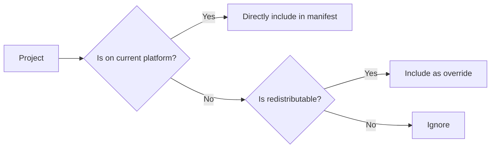

# Exporting a Modpack

To export your modpack, run the [`pakku export`] command:

<include from="pakku-export.md" element-id="snippet-cmd"></include>

Pakku will export your modpack in the following formats depending on your target:

<deflist type="medium">
  <def>
    <title>CurseForge (<code>.zip</code>) format</title>
    <list>
    <li><p>if your target is <code>curseforge</code> or <code>multiplatform</code></p></li>
    </list>
    <list>
    <li><p>path: <code>./build/curseforge/&lt;output_file&gt;</code></p></li>
    </list>
    </def>
  <def>
    <title>Modrinth (<code>.mrpack</code>) format</title>
    <list>
    <li><p>if your target is <code>modrinth</code> or <code>multiplatform</code></p></li>
    </list>
    <list>
    <li><p>path: <code>./build/modrinth/&lt;output_file&gt;</code></p></li>
    </list>
  </def>
  <def>
    <title>ServerPack (<code>.zip</code>) format</title>
    <list>
    <li><p>path: <code>./build/serverpack/&lt;output_file&gt;</code></p></li>
    </list>
  </def>
</deflist>

The `<output_file>` is based on your modpack's name and version.

Example output:


## Export Without Server Content

> Added in version **1.3.3**

Use the `--no-server` option to export a modpack without server-side content:

```bash
pakku export --no-server
```

### Behavior by Platform

<table>
<tr>
<th>Platform</th>
<th>No Server Export Behavior</th>
</tr>
<tr>
<td><b>CurseForge</b></td>
<td>No effect - uses standard export behavior</td>
</tr>
<tr>
<td><b>Modrinth</b></td>
<td>
<ul>
<li>Excludes all server-side mods (server-overrides) from the manifest</li>
<li>Does not export the <code>server-overrides/</code> directory</li>
<li>Only exports <code>overrides/</code> and <code>client-overrides/</code> directories</li>
</ul>
</td>
</tr>
<tr>
<td><b>ServerPack</b></td>
<td>Skips export entirely (no serverpack file is generated)</td>
</tr>
</table>

### Use Cases

The `--no-server` mode is useful when:

- You want to distribute a version of your modpack without server content
- You need to ensure no server-side content is accidentally included
- You're creating a specialized client build without server components

> **Note:** The `--no-server` option works independently from the [`export_server_side_projects_to_client`](Config-File.md#export_server_side_projects_to_client) configuration. When `--no-server` is used, it overrides the configuration setting for that export operation.

## Server-Side Mod Handling
{id="server-side-mod-handling"}

> Added in version **1.3.3**

Pakku provides fine-grained control over how server-side mods are handled in client modpack exports through the [`export_server_side_projects_to_client`](Config-File.md#export_server_side_projects_to_client) configuration option.

> **Important:** This configuration only affects **projects** in the manifest file. Override files (such as the `server-overrides/` directory) are always exported unless the `--no-server` flag is used.

### Behavior by Platform

<table>
<tr>
<th>Platform</th>
<th><code>export_server_side_projects_to_client = false</code></th>
<th><code>export_server_side_projects_to_client = true</code></th>
</tr>
<tr>
<td><b>CurseForge</b></td>
<td>Server-side mods are <b>excluded</b> from manifest.json (CurseForge doesn't support environment fields)</td>
<td>Server-side mods are <b>included</b> in manifest.json (backward compatible)</td>
</tr>
<tr>
<td><b>Modrinth</b></td>
<td>Server-side mods are <b>included</b> with <code>env.client = "unsupported"</code> (leverages Modrinth's native env field support)</td>
<td>Server-side mods are <b>included</b> with <code>env.client = "required"</code> (treated as BOTH-side for backward compatibility)</td>
</tr>
<tr>
<td colspan="3"><i>Note: In both cases, <code>server-overrides/</code> directory is exported</i></td>
</tr>
</table>

> **Why the difference?**
> 
> Modrinth supports native environment fields (`env.client` and `env.server`) that allow precise control over mod loading on different sides. This means Modrinth can include server-side mods in the client modpack while correctly marking them as `client = "unsupported"`, and compatible launchers will skip loading them on the client.
>
> CurseForge doesn't support environment fields, so the only way to prevent server-side mods from being installed on clients is to exclude them from the manifest entirely.

### Configuration

Set this in your [`pakku.json`](Config-File.md):

```json
{
  "export_server_side_projects_to_client": false
}
```

- **`false`** (recommended): Correctly handles server-side mods according to each platform's capabilities
- **`true`** (default): Maintains backward compatibility by including all mods

> Existing modpacks are automatically migrated to `true` when you first run Pakku after upgrading. New modpacks created with `pakku init` default to `false`.

### Example: Environment Fields in Modrinth

When exporting to Modrinth with `export_server_side_projects_to_client = false`, the generated `modrinth.index.json` will contain:

```json
{
  "files": [
    {
      "path": "mods/server-only-mod.jar",
      "env": {
        "client": "unsupported",
        "server": "required"
      }
    },
    {
      "path": "mods/client-mod.jar",
      "env": {
        "client": "required",
        "server": "unsupported"
      }
    },
    {
      "path": "mods/both-sides-mod.jar",
      "env": {
        "client": "required",
        "server": "required"
      }
    }
  ]
}
```


## How It Works?

Pakku uses an export profile system under the hood.
Currently, it is only possible to export the default profiles (`curseforge`, `modrinth` and `serverpack`).
However, exposing this functionality to users using scripting is planned for the v2.0.

Benefits from export profile system:

- Export profiles consist of number of export rule which control what happens on exporting.
- Export rules are purely functional.
- Each profile is independent and results in one exported file.

### Multiplatform Modpacks

Handling of projects in a multiplatform modpack:



## File Director Integration

If your modpack contains [File Director](https://github.com/TerraFirmaCraft-The-Final-Frontier/FileDirector), Pakku will automatically add missing projects to its config,
instead of packing them as [overrides](Pakku-Terminology.md#override).

[//]: # (## Technical Implementation Details)

[//]: # ()
[//]: # (### Exporting Flow)

[//]: # ()
[//]: # (```mermaid)

[//]: # (sequenceDiagram)

[//]: # (    participant CMD as Export Function)

[//]: # (    participant PRF as Export Profiles)

[//]: # (    participant RUL as Export Rules)

[//]: # (    participant PKG as Packaging Actions)

[//]: # (    participant OUT as Output)

[//]: # ()
[//]: # (    CMD->>PRF: Builds)

[//]: # (    activate PRF)

[//]: # (    PRF->>RUL: Produces)

[//]: # (    activate RUL)

[//]: # (    RUL-->>PRF: Rule Results)

[//]: # (    deactivate RUL)

[//]: # (    PRF->>PKG: Runs)

[//]: # (    activate PKG)

[//]: # (    PKG-->>PRF: Package Data)

[//]: # (    deactivate PKG)

[//]: # (    PRF->>OUT: Generate Output)

[//]: # (    activate OUT)

[//]: # (    OUT-->>CMD: Export Complete)

[//]: # (    deactivate OUT)

[//]: # (    deactivate PRF)

[//]: # (```)

[`pakku export`]: pakku-export.md