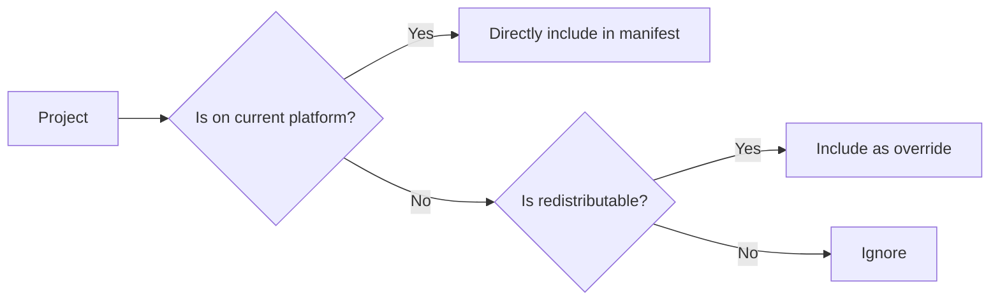

# Exporting a Modpack

To export your modpack, run the [`pakku export`] command:

<include from="pakku-export.md" element-id="snippet-cmd"></include>

Pakku will export your modpack in the following formats depending on your target:

<deflist type="medium">
  <def>
    <title>CurseForge (<code>.zip</code>) format</title>
    <list>
    <li><p>if your target is <code>curseforge</code> or <code>multiplatform</code></p></li>
    </list>
    <list>
    <li><p>path: <code>./build/curseforge/&lt;output_file&gt;</code></p></li>
    </list>
    </def>
  <def>
    <title>Modrinth (<code>.mrpack</code>) format</title>
    <list>
    <li><p>if your target is <code>modrinth</code> or <code>multiplatform</code></p></li>
    </list>
    <list>
    <li><p>path: <code>./build/modrinth/&lt;output_file&gt;</code></p></li>
    </list>
  </def>
  <def>
    <title>ServerPack (<code>.zip</code>) format</title>
    <list>
    <li><p>path: <code>./build/serverpack/&lt;output_file&gt;</code></p></li>
    </list>
  </def>
</deflist>

The `<output_file>` is based on your modpack's name and version.

Example output:


## Export Without Server Content

> Added in version **1.4.0**

Use the `--no-server` option to export a modpack without server-side content:

```bash
pakku export --no-server
```

## Server-Side Mod Handling
{id="server-side-mod-handling"}

> Added in version **1.4.0**

Use the [`export_server_side_projects_to_client`](Config-File.md#export_server_side_projects_to_client) configuration option to control how server-side mods are included in client modpack exports.

> For details on how project sides affect exporting behavior, see [Impact on Exporting](Overriding-Projects-Properties.md#impact-on-exporting).

## How It Works?

Pakku uses an export profile system under the hood.
Currently, it is only possible to export the default profiles (`curseforge`, `modrinth` and `serverpack`).
However, exposing this functionality to users using scripting is planned for the v2.0.

Benefits from export profile system:

- Export profiles consist of number of export rule which control what happens on exporting.
- Export rules are purely functional.
- Each profile is independent and results in one exported file.

### Multiplatform Modpacks

Handling of projects in a multiplatform modpack:



## File Director Integration

If your modpack contains [File Director](https://github.com/TerraFirmaCraft-The-Final-Frontier/FileDirector), Pakku will automatically add missing projects to its config,
instead of packing them as [overrides](Pakku-Terminology.md#override).

[`pakku export`]: pakku-export.md